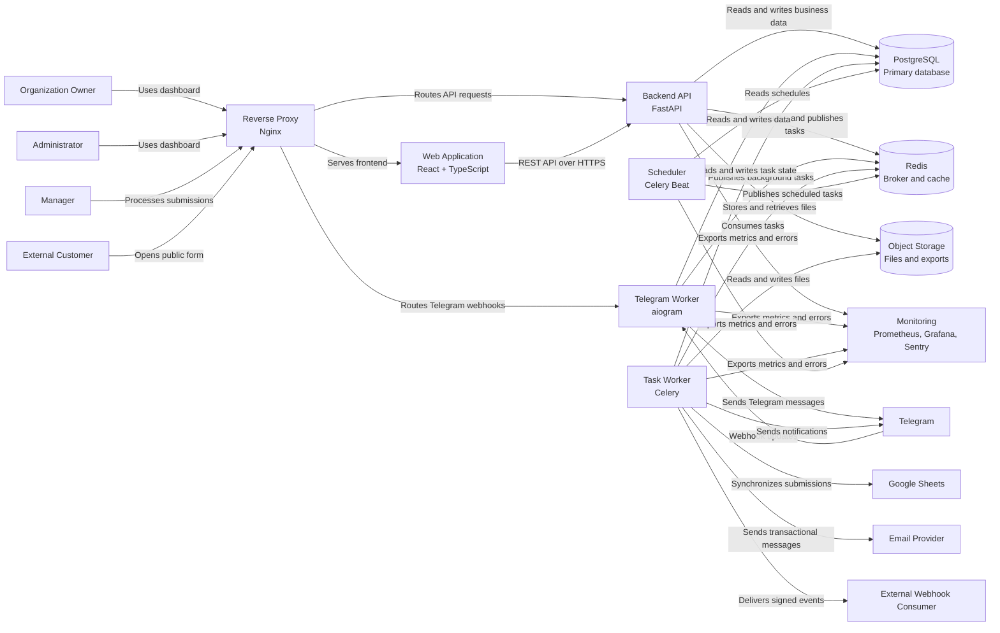

# FlowCore — C4 Container Diagram

**Version:** 1.0
**Status:** Draft
**Last Updated:** 2026-08-03

---

## 1. Purpose

This document describes the main containers of FlowCore using the C4 Model.

The diagram shows:

* the main applications and runtime processes;
* databases and supporting infrastructure;
* communication between containers;
* relationships with users and external systems;
* responsibilities of each container.

This document does not describe internal Python modules, classes, database tables, or implementation details.

---

## 2. Container Overview

FlowCore is implemented as a modular monolith with several independently running processes.

The core business logic remains inside a single backend codebase, while background processing, Telegram updates, scheduled jobs, frontend delivery, storage, and monitoring run as separate containers.

Main containers:

* Web Application
* Backend API
* Telegram Worker
* Task Worker
* Scheduler
* PostgreSQL
* Redis
* Object Storage
* Reverse Proxy
* Monitoring

---

## 3. Container Diagram



---

## 4. Containers

### 4.1 Reverse Proxy

**Technology:** Nginx

**Responsibilities:**

* accepts incoming HTTP and HTTPS traffic;
* terminates TLS connections;
* serves the frontend application;
* routes API requests to the Backend API;
* routes Telegram webhook requests;
* applies basic request size and timeout limits;
* forwards trusted proxy headers;
* provides a single public entry point.

**Does not:**

* contain business logic;
* access PostgreSQL directly;
* store application data;
* authenticate users independently from the Backend API.

---

### 4.2 Web Application

**Technology:**

* React
* TypeScript
* Vite
* TanStack Query
* React Router

**Responsibilities:**

* provides the browser-based user interface;
* displays organizations, projects, forms, submissions, workflows, and integrations;
* sends requests to the Backend API;
* validates basic input before sending it;
* manages local UI state;
* displays API errors and loading states.

**Does not:**

* access PostgreSQL directly;
* contain authoritative business rules;
* store secrets;
* decide whether a user has permission to perform an action.

All permissions are verified by the Backend API.

---

### 4.3 Backend API

**Technology:**

* Python
* FastAPI
* Pydantic
* SQLAlchemy
* Alembic
* asyncpg

**Responsibilities:**

* exposes the REST API;
* authenticates users;
* authorizes access to tenant data;
* executes synchronous application use cases;
* validates incoming requests;
* reads and writes business data;
* manages organizations, projects, forms, submissions, CRM, workflows, integrations, notifications, and audit records;
* creates transactional outbox events;
* publishes background tasks;
* generates OpenAPI documentation;
* exposes health, readiness, metrics, and version endpoints.

**Important rule:**

The Backend API must not execute slow external integrations inside the main HTTP transaction.

Operations such as:

* Google Sheets synchronization;
* email delivery;
* webhook delivery;
* bulk exports;
* scheduled notifications;

must be executed by the Task Worker.

---

### 4.4 Telegram Worker

**Technology:**

* Python
* aiogram 3

**Responsibilities:**

* receives Telegram webhook updates;
* identifies the connected bot and project;
* processes Telegram conversations;
* dynamically renders form fields;
* validates customer responses;
* creates submissions;
* sends confirmations;
* sends Telegram notifications;
* publishes background tasks when necessary.

**Security responsibilities:**

* validate webhook secrets;
* prevent one bot from accessing another tenant’s data;
* never log bot tokens;
* apply input validation and rate limiting;
* safely handle duplicate Telegram updates.

**Does not:**

* manage organization settings;
* expose the main REST API;
* execute long-running integrations synchronously.

---

### 4.5 Task Worker

**Technology:**

* Python
* Celery

**Responsibilities:**

* consumes asynchronous tasks from Redis;
* processes outbox events;
* executes workflow actions;
* synchronizes data with Google Sheets;
* sends emails;
* delivers webhooks;
* sends delayed notifications;
* generates exports;
* performs retryable external operations;
* stores execution results;
* records failures and retry history.

**Reliability requirements:**

* tasks must be idempotent where possible;
* retries must use backoff;
* retry count must be limited;
* permanent failures must be stored;
* duplicate task execution must not corrupt data.

---

### 4.6 Scheduler

**Technology:**

* Celery Beat

**Responsibilities:**

* triggers scheduled workflows;
* sends reminder tasks;
* starts periodic cleanup tasks;
* schedules integration retries;
* launches reporting jobs;
* publishes tasks to Redis.

**Does not:**

* execute business tasks itself;
* store schedules only in memory;
* directly communicate with external integrations.

The Scheduler publishes tasks, while Task Worker executes them.

---

### 4.7 PostgreSQL

**Technology:** PostgreSQL

**Role:** Primary source of truth.

**Stores:**

* users;
* sessions;
* organizations;
* members;
* roles and permissions;
* projects;
* forms and form versions;
* submissions and answers;
* CRM data;
* workflows;
* integration configuration;
* notifications;
* audit logs;
* outbox events;
* task execution state;
* idempotency keys.

**Architectural rules:**

* all schema changes use Alembic migrations;
* tenant-owned tables include `organization_id`;
* Redis is not used as permanent business storage;
* Google Sheets is not the primary source of truth;
* database transactions define consistency boundaries.

---

### 4.8 Redis

**Technology:** Redis

**Responsibilities:**

* acts as Celery broker;
* stores short-lived cache values;
* supports rate limiting;
* stores temporary locks;
* stores short-lived coordination data.

**Does not store:**

* authoritative submissions;
* user accounts;
* organization data;
* audit history;
* permanent workflow state.

Loss of Redis must not cause permanent loss of business data.

---

### 4.9 Object Storage

**Technology:**

* S3-compatible storage;
* MinIO for local development;
* managed S3-compatible service in production.

**Responsibilities:**

* stores uploaded files;
* stores generated exports;
* stores attachments;
* stores temporary report files;
* provides signed download URLs.

**Security requirements:**

* private buckets by default;
* file size limits;
* MIME type validation;
* malware scanning where required;
* tenant-aware object paths;
* temporary signed URLs;
* no public access to sensitive files.

---

### 4.10 Monitoring

**Technology:**

* Prometheus
* Grafana
* Sentry

**Responsibilities:**

* collects application metrics;
* displays dashboards;
* tracks errors;
* monitors worker queues;
* monitors API latency;
* tracks integration failures;
* supports alerting;
* helps diagnose production incidents.

Monitoring is separate from the audit log.

Technical monitoring answers:

* Is the system healthy?
* Is the API slow?
* Are tasks failing?

Audit logging answers:

* Who changed a role?
* Who published a form?
* Who modified a submission?

---

## 5. External Systems

### Telegram

FlowCore receives webhook updates and sends messages through the Telegram Bot API.

Telegram is treated as an unreliable external dependency.

Possible failures:

* timeout;
* rate limit;
* invalid bot token;
* blocked bot;
* duplicated update;
* network error.

---

### Google Sheets

Task Worker synchronizes selected submission data with Google Sheets.

PostgreSQL remains the primary source of truth.

Synchronization failures must not delete or roll back the original submission.

---

### Email Provider

Used for:

* email verification;
* password reset;
* invitations;
* notifications.

Email sending is asynchronous.

---

### External Webhook Consumer

Receives signed HTTP requests after configured business events.

Every delivery must record:

* target URL;
* event type;
* attempt number;
* response status;
* response time;
* failure reason;
* next retry time.

---

## 6. Main Request Flow

### Authenticated Web Request

```text
User
  ↓
Reverse Proxy
  ↓
Web Application
  ↓
Backend API
  ↓
Authorization and validation
  ↓
PostgreSQL transaction
  ↓
HTTP response
```

---

### Public Form Submission

```text
External Customer
  ↓
Reverse Proxy
  ↓
Backend API
  ↓
Validate published form version
  ↓
Create submission
  ↓
Create outbox event
  ↓
Commit PostgreSQL transaction
  ↓
Return confirmation
```

---

### Asynchronous Integration Flow

```text
Outbox event
  ↓
Task is published to Redis
  ↓
Task Worker receives task
  ↓
Google Sheets / Email / Telegram / Webhook
  ↓
Execution result is saved in PostgreSQL
```

---

### Telegram Submission Flow

```text
External Customer
  ↓
Telegram
  ↓
Reverse Proxy
  ↓
Telegram Worker
  ↓
Load bot and published form
  ↓
Collect and validate answers
  ↓
Create submission in PostgreSQL
  ↓
Publish workflow task to Redis
  ↓
Send confirmation
```

---

## 7. Communication Rules

### Synchronous communication

Used when the caller requires an immediate result.

Examples:

* login;
* create organization;
* create project;
* publish form;
* load submissions;
* update submission status.

Primary protocol:

```text
HTTPS + REST
```

---

### Asynchronous communication

Used for slow, retryable, or failure-prone operations.

Examples:

* email sending;
* Google Sheets synchronization;
* webhook delivery;
* scheduled tasks;
* export generation;
* workflow actions.

Primary mechanism:

```text
Redis + Celery
```

---

## 8. Data Ownership

### Backend API

Owns the authoritative business state in PostgreSQL.

### Telegram Worker

Does not own a separate business database. It uses the same application data through controlled application services.

### Task Worker

Does not own separate business entities. It executes asynchronous use cases and stores execution results.

### Scheduler

Owns no business data. It reads schedules and publishes tasks.

### Web Application

Owns only temporary client-side state.

### Redis

Owns no permanent business state.

### Google Sheets

Contains synchronized copies of selected data, not authoritative records.

---

## 9. Deployment Model

For the first production version, all containers may run on one VPS through Docker Compose:

```text
Reverse Proxy
Web Application
Backend API
Telegram Worker
Task Worker
Scheduler
PostgreSQL
Redis
Object Storage
Monitoring
```

This is acceptable for the first release because:

* the project is developed by one developer;
* operational complexity remains manageable;
* containers can be scaled separately later;
* the modular monolith does not require microservices.

---

## 10. Security Boundaries

The following boundaries must be enforced:

* all public traffic passes through the Reverse Proxy;
* PostgreSQL and Redis are not publicly accessible;
* internal containers use a private Docker network;
* users access data only through authorized API endpoints;
* every tenant query is scoped by `organization_id`;
* integration credentials are encrypted;
* secrets are never returned in API responses;
* webhook requests are signed;
* Telegram webhook requests are verified;
* object storage uses private access;
* all production traffic uses HTTPS.

---

## 11. Failure Handling

### PostgreSQL unavailable

* readiness check fails;
* write operations stop;
* application must not report itself as ready;
* no fallback database is used.

### Redis unavailable

* synchronous API operations may continue when possible;
* background tasks cannot be published;
* the failure must be visible in monitoring;
* business data already stored in PostgreSQL is preserved.

### External integration unavailable

* the original transaction remains committed;
* Task Worker retries the operation;
* failed attempts are recorded;
* permanent failure is visible to the user.

### Task Worker unavailable

* tasks remain queued;
* API continues accepting requests if Redis and PostgreSQL are available;
* monitoring detects queue growth.

---

## 12. Key Architectural Constraints

* FlowCore remains a modular monolith.
* PostgreSQL is the primary source of truth.
* Redis is an auxiliary service.
* External integrations are asynchronous where possible.
* Container boundaries do not replace module boundaries.
* Business logic must not be duplicated between API and workers.
* All processes use the same application and domain rules.
* Direct database access from the frontend is prohibited.
* Direct access to another module’s internal implementation is prohibited.
* Infrastructure failures must not silently lose business data.

---

## 13. Out of Scope for This Diagram

This document does not describe:

* Python package structure;
* domain entities;
* application services;
* repository interfaces;
* database tables;
* REST endpoints;
* workflow node types;
* deployment commands;
* Kubernetes;
* multi-region infrastructure.

Internal module structure is described in:

```text
docs/architecture/modules.md
```

Architecture decisions are described in:

```text
docs/adr/
```
