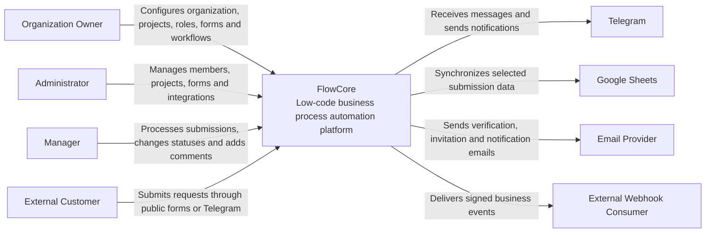

# FlowCore — C4 System Context

**Version:** 1.0  
**Status:** Draft  
**Last Updated:** 2026-08-03

---

## 1. Purpose

This document describes the system context of FlowCore using the C4 Model.

The diagram shows:

- primary users of the platform;
- the FlowCore system;
- external systems FlowCore integrates with;
- high-level relationships between all participants.

This document does not describe internal application containers, modules, databases, or implementation details.

---

## 2. System Overview

FlowCore is an open-source low-code platform for business process automation.

It allows organizations to:

- create projects;
- build dynamic forms;
- collect customer submissions;
- manage requests in CRM;
- automate workflows;
- connect Telegram;
- synchronize data with Google Sheets;
- send notifications;
- integrate with external systems through webhooks and REST API.

---

## 3. Actors

### Organization Owner

The person responsible for configuring the organization and its business processes.

Main responsibilities:

- creates and manages the organization;
- creates projects;
- manages team members and roles;
- configures forms and workflows;
- connects integrations;
- reviews audit logs.

Restrictions:

- can access only organizations they belong to;
- cannot access data of other tenants.

---

### Administrator

A user who manages organization settings and operational configuration.

Main responsibilities:

- manages members;
- configures projects;
- manages forms;
- configures integrations;
- reviews system activity.

Restrictions:

- cannot access other organizations;
- permissions depend on assigned role.

---

### Manager

A user responsible for processing customer requests.

Main responsibilities:

- views submissions;
- changes request statuses;
- assigns responsible employees;
- adds comments;
- receives notifications.

Restrictions:

- cannot change organization ownership;
- cannot manage sensitive integrations unless permission is granted.

---

### External Customer

A person who submits a request through a public form, Telegram bot, or external channel.

Main responsibilities:

- provides required information;
- submits a request;
- may receive confirmation or status notification.

Restrictions:

- has no access to the internal FlowCore dashboard;
- cannot view organization data;
- cannot view other customer requests.

---

## 4. External Systems

### Telegram

Used as a communication channel between customers, managers, and FlowCore.

FlowCore uses Telegram to:

- receive customer messages;
- collect form responses;
- create submissions;
- notify managers;
- send confirmations.

---

### Google Sheets

Used as an external reporting and data synchronization service.

FlowCore uses Google Sheets to:

- create rows for new submissions;
- synchronize selected business data;
- provide familiar spreadsheet access for users.

Google Sheets is not the primary source of truth.

---

### Email Provider

Used for transactional email delivery.

FlowCore uses the email provider to send:

- email verification messages;
- password reset messages;
- invitations;
- operational notifications.

---

### External Webhook Consumer

An external application that receives FlowCore events.

Examples:

- CRM systems;
- internal company services;
- analytics platforms;
- automation platforms.

FlowCore sends signed webhook requests after configured events.

---

## 5. System Context Diagram



---

## 6. Relationships

### Organization Owner → FlowCore

The owner uses FlowCore to configure the organization, projects, team members, forms, workflows, and integrations.

---

### Administrator → FlowCore

The administrator manages operational settings and supports organization members.

---

### Manager → FlowCore

The manager processes customer submissions and manages their lifecycle.

---

### External Customer → FlowCore

The customer submits business information through public interfaces.

---

### FlowCore → Telegram

FlowCore receives messages, collects customer data, creates submissions, and sends notifications.

---

### FlowCore → Google Sheets

FlowCore synchronizes selected submission data to spreadsheets.

PostgreSQL remains the primary source of truth.

---

### FlowCore → Email Provider

FlowCore sends transactional emails related to identity, access, and notifications.

---

### FlowCore → External Webhook Consumer

FlowCore sends signed HTTP requests when configured business events occur.

---

## 7. Trust Boundaries

FlowCore must enforce the following boundaries:

- each organization is treated as an isolated tenant;
- users can access only organizations where they are members;
- external customers cannot access internal organization data;
- integration credentials must be encrypted and never exposed through API responses;
- webhook requests must be signed;
- Telegram bot tokens and Google credentials must never be logged;
- external systems must be treated as unreliable dependencies.

---

## 8. Key Architectural Constraints

- FlowCore is a multi-tenant system.
- PostgreSQL is the primary source of truth.
- Redis is not used as permanent business storage.
- External integrations may fail or respond slowly.
- Long-running integration operations must not block normal HTTP requests.
- Sensitive credentials must be stored securely.
- All access to tenant data must be authorized.
- Public submission endpoints must be protected with validation and rate limiting.

---

## 9. Main Business Flow

```text
External Customer
    ↓
Public Form or Telegram
    ↓
FlowCore validates input
    ↓
Submission is stored
    ↓
Submission appears in CRM
    ↓
Manager processes submission
    ↓
Workflow is triggered
    ↓
Telegram / Google Sheets / Email / Webhook actions are executed
```

---

## 10. Out of Scope for This Diagram

This diagram does not describe:

- Backend API;
- Web Application;
- PostgreSQL;
- Redis;
- Task Worker;
- Telegram Worker;
- Scheduler;
- Object Storage;
- reverse proxy;
- monitoring;
- internal modules;
- database tables;
- deployment topology.

These elements will be described in `c4-container.md` and other architecture documents.